# Google Cloud Tutorial

This tutorial is for using the Google Cloud platform with a Particle device, such as a Photon or Electron, to store data into a cloud database.

Updates to this document are here:
[https://github.com/rickkas7/google\_cloud\_tutorial] (https://github.com/rickkas7/google_cloud_tutorial)

## Initial Google setup

The beginning steps are nearly identical to the steps in the [Particle Google Cloud Platform Tutorial] (https://docs.particle.io/tutorials/topics/google-cloud-platform/), and you should also read that for additional tips.

This is also designed to be very similar to my [Google Firebase Tutorial] (https://github.com/rickkas7/firebase_tutorial), except it uses Google Pub/Sub instead of Webhooks to access the database. Firebase is easier to get up and running quickly; this method is more powerful and scalable.

There is a lot of [documentation for the Google Cloud] (https://cloud.google.com), as there are many, many parts to it. I'll only be using Pub/Sub, Datastore and App Engine for this tutorial.

Sign up for the [Google Cloud Platform Free Trial] (https://cloud.google.com/free-trial/). When done, you should see your Google Cloud Platform dashboard:

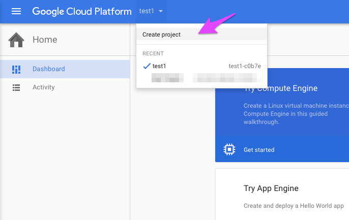

To the right of Google Cloud Platform at the top of the window is a drop down menu. Select **Create project**. 

You can see the test1 project from the Google Firebase tutorial, which didn't use the Google Cloud Platform, but clearly all of the pieces connect together somehow within Google.

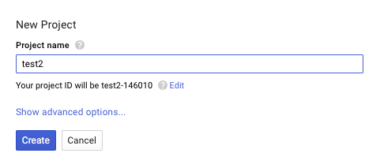

This project is "test2". You'll be using the project ID frequently; it's the longer string with the unique number, "test2-146010" in this case.

The next step is to enable the Pub/Sub service. All of the services are in the menu at the top left corner of the window:

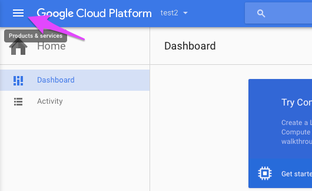

Select Pub/Sub (you'll probably have to scroll down) and enable the API:

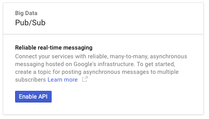

And create a topic:

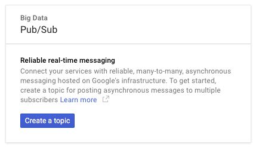

The first part of the topic name is fixed, but I added the test2 part at the end.

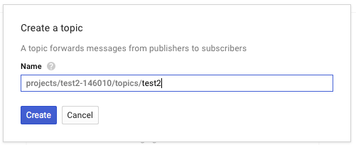

Note that your topic will be different, even if you're following this exactly, because the number at the beginning will be different. But it should follow the same pattern. 

Now set the permissions for the new topic:

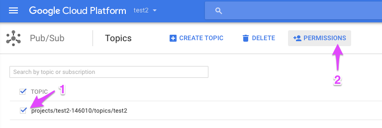

Select the checkbox to the left of the topic name (1), then click the **Permissions** button above it (2).

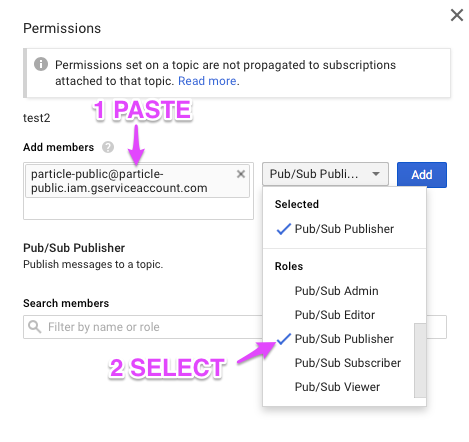

In the Add members box (1), enter: 

```
particle-public@particle-public.iam.gserviceaccount.com
```

Then select **Pub/Sub Publisher** from the drop-down menu (2). You'll need to scroll down to find it.

And finally click **Add**.

## Particle console setup

You'll need log into to the [Particle console] (https://console.particle.io).

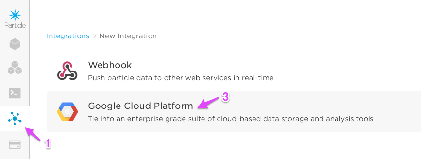

Select the integrations icon on the left side (1), click the **New Integration button** (not pictured) and then **Google cloud platform** (3) when that appears.

There is a warning about steps you need to complete, but all of these should have been done above so you can confirm.

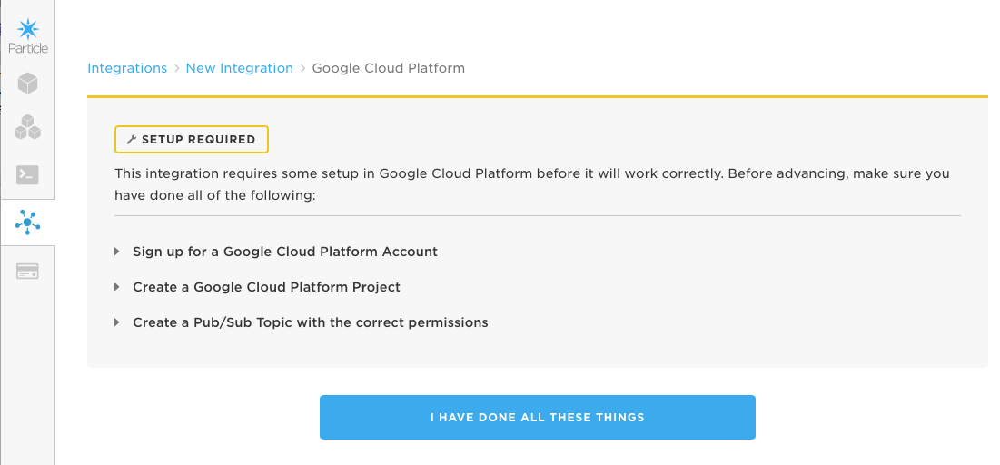

Then set the integration parameters:

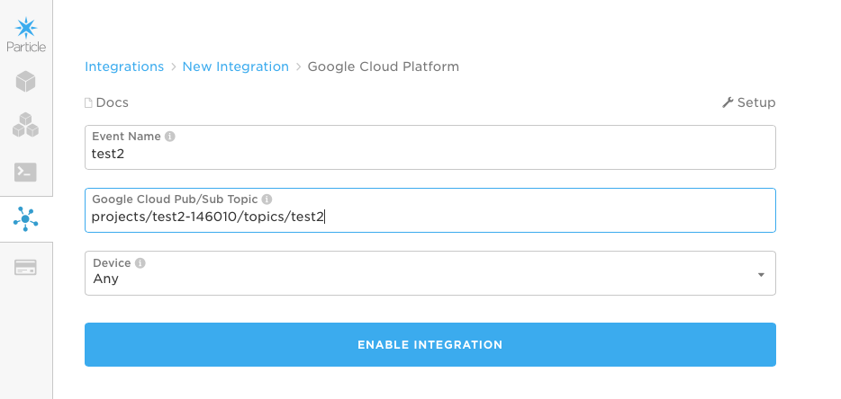

**Event Name** is the Particle.publish name to match, and I used `test2`. Remember that event names are a prefix, so this integration will also be called for "test2data" and "test23" so beware!

**Google Cloud Pub/Sub Topic** is what I set above. Yours will have a different number in it.

```
projects/test2-146010/topics/test2
```

I set the the **Device** to **Any** to allow any of my devices to trigger the integration. 

Then use the **Test** button to test it.

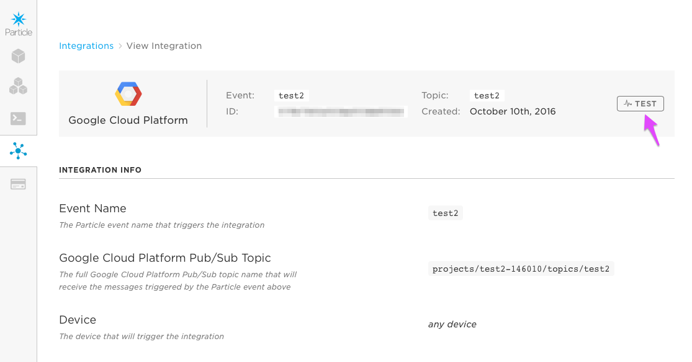

A green Success box should appear in the lower left corner of the window if the integration is working so far.

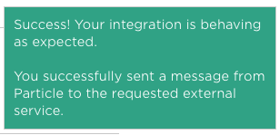

You can also test this using the [Particle CLI] (https://particle.io/cli/).

```
particle publish test2 "testing" --private
```

Note that the Logs part of the Integration panel does not live update, so you'll need to exit and reopen the integration to see updates.

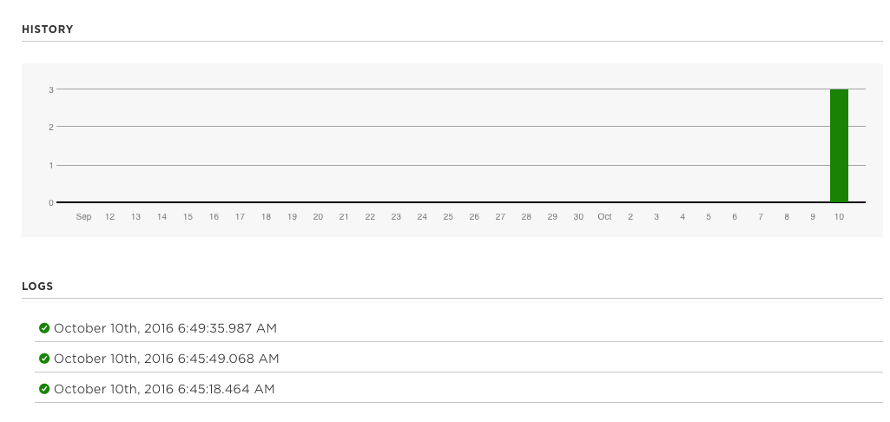

Here there are three log entries, two from my hitting the Test button and one from using the CLI. So far so good!

## Using Google shell (web-based)

Back at the Google Cloud Platform Console, select the **Activate Google Cloud Shell** via the icon at the top of the screen.

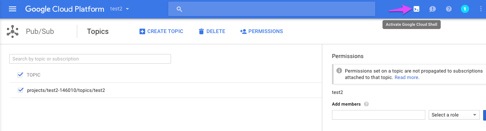

Create a subscription:

```
gcloud beta pubsub subscriptions create test2 --topic test2
```

The topic "test2" at the end is the topic name, without the "projects/test2-146010/topics/" part, and must match what you set it to above.

Generate an event using the Particle CLI (not the Google console):

```
particle publish test2 "testing" --private
```

And then check to see if it arrived in the Google shell:

```
gcloud beta pubsub subscriptions pull test2 --auto-ack --max-messages 100
```

Hopefully, it did!

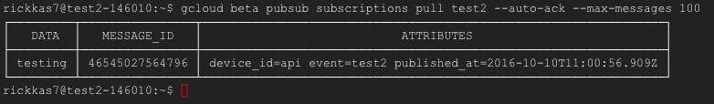

Later on, we'll add the [Google Cloud SDK] (https://cloud.google.com/sdk/docs/) command lines that allow the same functions from your regular command line instead of a command line web browser window, but for now the web shell is pretty handy. Leave it open because we'll use it once more below.


## Photon firmware

If you've seen the Firebase example, this is the same as example 2, except for the event name. You'll want that to match what you used above for the Particle event name. I kept the Particle event name the same as the Google Pub/Sub name, but this isn't required.

This example just outputs some random data in JSON format for testing.

```
#include "Particle.h"

// Test Program #1 for Google Cloud
// Just generates some simple random data once a minute. Also sends up the device name.

#include <math.h> // This is just for cos and M_PI, used in generating random sample data

// Forward declarations
void publishData();
void deviceNameHandler(const char *topic, const char *data);

const unsigned long PUBLISH_PERIOD_MS = 60000;
const unsigned long FIRST_PUBLISH_MS = 10000;
const char *PUBLISH_EVENT_NAME = "test2data";

unsigned long lastPublish = FIRST_PUBLISH_MS - PUBLISH_PERIOD_MS;
int nextValue = 1;
String deviceName;

void setup() {
	Serial.begin(9600);

	Particle.subscribe("spark/", deviceNameHandler);
	Particle.publish("spark/device/name");
}

void loop() {
	if (millis() - lastPublish >= PUBLISH_PERIOD_MS) {
		lastPublish = millis();
		if (deviceName.length() > 0) {
			publishData();
		}
	}
}

void publishData() {
	// This just publishes some somewhat random data for testing

	// a is a monotonically increasing integer
	int a = nextValue++;

	// double value b is a cosine, so the values will rise and fall nicely over 360 steps
	double b = cos((double)(a % 360) * M_PI / 180.0);

	// c is a random integer
	int c = rand();

	char buf[256];
	snprintf(buf, sizeof(buf), "{\"a\":%d,\"b\":%.3f,\"c\":%d,\"n\":\"%s\"}", a, b, c, deviceName.c_str());
	Serial.printlnf("publishing %s", buf);
	Particle.publish(PUBLISH_EVENT_NAME, buf, PRIVATE);
}

void deviceNameHandler(const char *topic, const char *data) {
	deviceName = data;
}

```

With that running, you can check the Google shell for events:

```
gcloud beta pubsub subscriptions pull test2 --auto-ack --max-messages 100
```

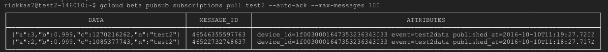

Looks good! Actually, that's a little hard to see, but the data contains the JSON data that is expected, like:

```
 {"a":3,"b":0.999,"c":1270216262,"n":"test2"}
```

You can clean up the subscription that you created using this in the Google shell as you won't need this one anymore.

```
gcloud beta pubsub subscriptions delete test2 
```

Also, you should see the events in the Particle console, in Logs tab. The events should look a lot like a regular webhook transaction:

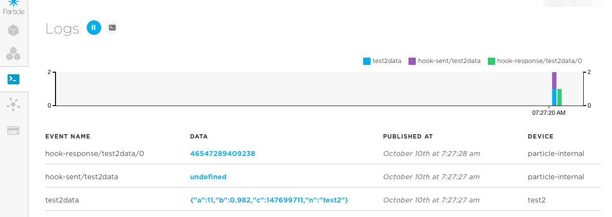


## Doing something with the data

Now comes the tricky part. The [official Particle tutorial] (https://docs.particle.io/tutorials/topics/google-cloud-platform/) uses a node.js script that you run on your own computer, which is quick and easy.

It looks like [Cloud Dataflow] (https://cloud.google.com/dataflow/) might be appropriate for processing large amounts of data. It's pretty complicated, so I think I'll wait on that for a future tutorial.

[Cloud Functions] (https://cloud.google.com/functions/) would be nice for this, I think. They're basically bits of code that get executed when something, like a pub/sub event, occur. Unfortunately cloud functions are in alpha and you need to sign up and get approved, and I haven't been approved yet.

That leaves [App Engine] (https://cloud.google.com/appengine/). At first this seemed like overkill, but it's actually not that difficult to use. And, since you get 28 instance hours of app engine per day in the free tier, if you don't use it too much it's still free. And, once you beyond simple samples, there is so much customization you can do, not only for storing the data, but also retrieving and displaying it. That seems ideal for a more complex example, say one that also had web pages for visualizing the data, etc..

## Setting up App Engine

There are a bunch of options when using app engine, but since the [official Particle example] (https://github.com/spark/google-cloud-datastore-tutorial) was already written in node.js and I'm familiar with that, I decided to use a [flexible environment node.js] (https://cloud.google.com/appengine/docs/flexible/nodejs/) configuration for my app engine.

Running through the [quickstart] (https://cloud.google.com/appengine/docs/flexible/nodejs/quickstart) will get the prerequisites installed and functioning. If you want to get a feel for how this works, go through the hello world, pub/sub and cloud datastore how-tos, which is how I figured out how to do this. Though note that the pub/sub app engine example uses push mode and I ended up using pull mode, so there are some differences there.

### Install Google Cloud SDK

The only step you really need to do if you just want to deploy the sample is to install the [Google Cloud SDK] (https://cloud.google.com/sdk/docs/). This provides local command line tools on your computer so you can deploy the code. There are easy installers for Windows, Mac and Linux.


## App engine pub/sub storage example

We need a new pull subscription in order to implement this. 

Select [Pub/Sub] (https://console.cloud.google.com/cloudpubsub/topicList) from the main menu (the lines icon in the upper left corner of the window) in the Google Cloud console.

Then check the checkbox for your project and event (1) and hover to the right and select **New subscription**.

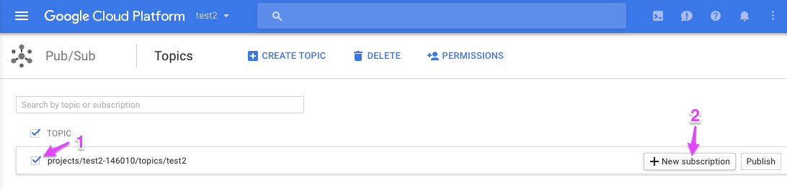

Then fill in the subscription name. The first part is fixed, I just added the `test2db` part. Select **Pull** as the delivery type.

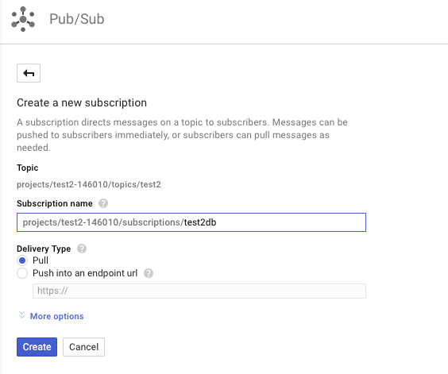


### Getting the source

The app source is in the same place as this tutorial, in the 1-app directory.

[https://github.com/rickkas7/google\_cloud\_tutorial] (https://github.com/rickkas7/google_cloud_tutorial)

You will probably want to clone or download the repository to your computer and then use the 1-app directory for this tutorial.


### Running the example locally

The end goal is to run this code remotely on the Google cloud, but it takes a while to deploy a new VM running your code, so it's helpful and a huge time saver to be able to run it locally while you're developing your own code. Fortunately, the system is designed to make this (relatively) easy. 

If you're only going to run the example in the cloud, you can skip to the next section, if you prefer.

Go to [Google API Manager] (https://console.developers.google.com/project/_/apis/credentials) and select your project (test2, in my case).

Select **Create credentials** and then **Service account key**.

In the Credentials window, select **App Engine default service account** and a **JSON** key type and click Create. A new file will be downloaded to your computer. 

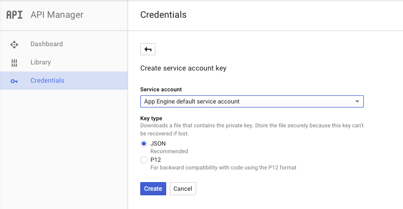

My file was test2-4f42ca1a6f8b.json. Keep this file secure. Don't share it online or even check it into github. It's intended to be specific to your computer. I copied mine to a credentials directory that is at the same level as my app source directory. Doing it this way makes sure I won't accidentally commit the file to git.

If you want to test your code locally you must have Google Cloud SDK and node.js prerequisites installed as mentioned above. 

```
cd 1-app
npm install
```

This will install all of the dependencies in the node_modules subdirectory.

The following commands will run the server locally:

```
export GOOGLE_APPLICATION_CREDENTIALS=../credentials/test2-4f42ca1a6f8b.json
export GCLOUD_PROJECT=test2-146010
export PUBSUB_VERIFICATION_TOKEN=PLIRKOQ413FAAS4H2MX5WQ6O
export PUBSUB_TOPIC=test2
export PUBSUB_SUBSCRIPTION_NAME=test2db
npm start
```

The `GOOGLE_APPLICATION_CREDENTIALS` line specifies the app credentials file I downloaded above. The name and path will vary depending on where you downloaded and moved it to and its name.

The rest of the parameters match the values in app.yaml, which you should also edit because that's what used when you deploy to the cloud. The fields are explained in greater detail in the next section if you're unsure of what to set them to.

When you run it, you should see something like:

```
$ npm start

> particle-datastore@0.0.1 start /Users/rickkas7/Documents/src/googlecloud/2simpleserver
> node app.js

App listening on port 8080
Press Ctrl+C to quit.
```

And, with any luck, if you turn on your photon with the code above, something like this:

```
event received { ackId: 'RUFeQBJMJxhESVMrQwsqWBFOBCEhPjA-RVNEUAYWLF1GSFE3GQhoUQ5PXiM_NSAoRREICBQFfH1xXVJ1WFUaB1ENGXJ8ZHI5UxEJC0NWKlVSEQ16bVxXOVcOGXp8aXVqUhUGBU1bVpLO7_FaZho9XxJLLD5-LC0',
  id: '63081800867788',
  data: { a: 24, b: 0.914, c: 1196032868, n: 'test4' },
  attributes: 
   { device_id: '1e0032123447343149111039',
     event: 'test2data',
     published_at: '2016-10-15T16:43:22.672Z' },
  ack: [Function: bound ],
  skip: [Function] }
stored in datastore { published_at: '2016-10-15T16:43:22.672Z',
  a: 24,
  b: 0.914,
  c: 1196032868,
  n: 'test4' }
```

And, if you go to the Google console Datastore page, you can see the log entries that were created:

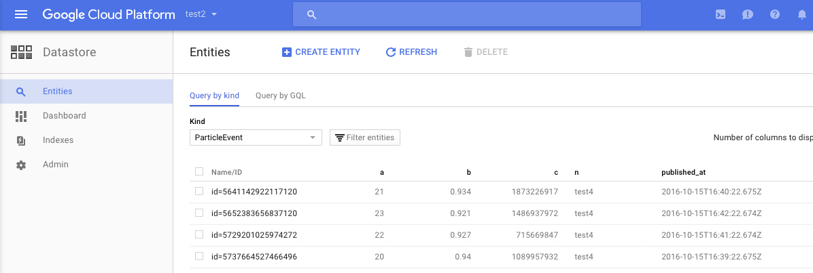

### Deploying to the cloud

That wasn't too bad, but the goal is to deploy to the cloud. Fortunately, this is almost easier than running locally.

Make sure you've updated app.yaml, in particular this section:

```
env_variables:
  GCLOUD_PROJECT: test2-146010
  PUBSUB_TOPIC: test2
  PUBSUB_SUBSCRIPTION_NAME: test2db
  # This token is used to verify that requests originate from your
  # application. It can be any sufficiently random string.
  PUBSUB_VERIFICATION_TOKEN: PLIRKOQ413FAAS4H2MX5WQ6O
```

`GCLOUD_PROJECT` is your project ID. 

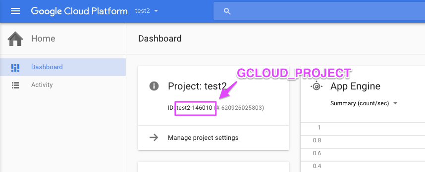

`PUBSUB_TOPIC` and `PUBSUB_SUBSCRIPTION_NAME` are in the Pub/Sub configuration. 


The `PUBSUB_VERIFICATION_TOKEN` is just a random string. You can set it to any random string. 


Once those are set, deploy it!

```
gcloud app deploy
```

This will take a while to complete, but when you're done, it should display this:

```
Updating service [default]...done.                                              
Deployed service [default] to [https://test2-146010.appspot.com]

You can read logs from the command line by running:
  $ gcloud app logs read

To view your application in the web browser run:
  $ gcloud app browse

```

The browse function won't work for this app because I didn't implement any web browser pages. But the logs read command still works great:

```
gcloud app logs read
```

One thing to beware of: Deploying a new instance doesn't stop the old one first! Make sure you to clean up the old instances and versions from the console App Engine page.


The storeEvent function in app.js does the important work of getting things out of the pub/sub event and making it into the format you want to store in the database:

```
function storeEvent(message) {
    var key = datastore.key('ParticleEvent');

    // You can uncomment some of the other things if you want to store them in the database
    var obj = {
		// gc_pub_sub_id: message.id,
		// device_id: message.attributes.device_id,
		// event: message.attributes.event,
		published_at: message.attributes.published_at
	}

    // Copy the data in message.data, the Particle event data, as top-level 
    // elements in obj. This breaks the data out into separate columns.
    for (var prop in message.data) {
        if (message.data.hasOwnProperty(prop)) {
            obj[prop] = message.data[prop];
        }
    }
```

This adds the published_at, and then copies out the data from the Particle event sent by the Photon. That data originally looked like this:

```
{"a":29,"b":0.875,"c":1883488164,"n":"test4"}
```

If you add additional data to the event data JSON object from the Particle side, it automatically adds new columns in the database automatically. Neat!

## Firmware for Electron

Here's a slightly modified version of the Photon firmware above that's better suited for the Electron. It saves the device name in retained memory so it doesn't need to be retrieved every time. It also goes to sleep between samplings to save battery.

```
#include "Particle.h"

// Test Program #4 for Firebase Integration
// Similar to #2, but optimized for the Electron. Goes to sleep between samples.
// Just generates some simple random data once a minute, stores in a per-device table
// using the device name as the key.
STARTUP(System.enableFeature(FEATURE_RETAINED_MEMORY));

#include <math.h> // This is just for cos and M_PI, used in generating random sample data

SYSTEM_THREAD(ENABLED);

// Forward declarations
void publishData();
void deviceNameHandler(const char *topic, const char *data);

const unsigned long POST_CONNECT_WAIT_MS = 8000;
const unsigned long NAME_WAIT_MS = 20000;
const unsigned long POST_PUBLISH_WAIT_MS = 2000;
const unsigned long MAX_CONNECT_TIME_MS = 120000;
const unsigned long SLEEP_TIME_SEC = 3600;
const char *PUBLISH_EVENT_NAME = "test2data";

const uint32_t RETAINED_DATA_MAGIC = 0xa2c7206a;
const size_t DEVICE_NAME_MAX_LEN = 31;
typedef struct {
	uint32_t magic;
	char deviceName[DEVICE_NAME_MAX_LEN + 1];
} RetainedData;

enum State {
	START_STATE,
	CONNECTED_WAIT_STATE,
	POST_CONNECT_WAIT_STATE,
	GET_NAME_STATE,
	NAME_WAIT_STATE,
	PUBLISH_STATE,
	POST_PUBLISH_WAIT_STATE,
	SLEEP_STATE
};

retained RetainedData retainedData = {0};

int nextValue = 1;
State state = START_STATE;
unsigned long stateTime = 0;

void setup() {
	Serial.begin(9600);

}

void loop() {
	switch(state) {
	case START_STATE:
		state = CONNECTED_WAIT_STATE;
		stateTime = millis();
		break;

	case CONNECTED_WAIT_STATE:
		if (Particle.connected()) {
			Serial.println("connected to the cloud");
			state = POST_CONNECT_WAIT_STATE;
		}
		else
		if (millis() - stateTime >= MAX_CONNECT_TIME_MS) {
			// Failed to connect to the cloud, go to sleep and try again later
			Serial.println("failed to connect to cloud");
			state = SLEEP_STATE;
		}
		break;

	case POST_CONNECT_WAIT_STATE:
		if (millis() - stateTime >= POST_CONNECT_WAIT_MS) {
			state = GET_NAME_STATE;
		}
		break;

	case GET_NAME_STATE:
		if (retainedData.magic != RETAINED_DATA_MAGIC || retainedData.deviceName[0] == 0) {
			memset(&retainedData, 0, sizeof(retainedData));
			retainedData.magic = RETAINED_DATA_MAGIC;

			Particle.subscribe("spark/", deviceNameHandler);
			Particle.publish("spark/device/name");
			state = NAME_WAIT_STATE;
			stateTime = millis();
		}
		else {
			Serial.printlnf("device name in retained memory %s", retainedData.deviceName);
			state = PUBLISH_STATE;
			stateTime = millis();
		}
		break;

	case NAME_WAIT_STATE:
		if (retainedData.deviceName[0] != 0) {
			Serial.printlnf("device name from cloud %s", retainedData.deviceName);
			state = PUBLISH_STATE;
			stateTime = millis();
		}
		else
		if (millis() - stateTime >= NAME_WAIT_MS) {
			// Failed to connect to the cloud, go to sleep and try again later
			Serial.println("failed to get device name");
			state = SLEEP_STATE;
		}
		break;


	case PUBLISH_STATE:
		publishData();

		state = POST_PUBLISH_WAIT_STATE;
		stateTime = millis();
		break;

	case POST_PUBLISH_WAIT_STATE:
		if (millis() - stateTime >= POST_PUBLISH_WAIT_MS) {
			state = SLEEP_STATE;
		}
		break;

	case SLEEP_STATE:
		Serial.printlnf("going to sleep for %d seconds", SLEEP_TIME_SEC);

		// This delay is just so you can see the serial print go out, feel free to remove if desired
		delay(250);

		System.sleep(SLEEP_MODE_DEEP, SLEEP_TIME_SEC);

		// Not reached; when waking up from SLEEP_MODE_DEEP, the code starts again from setup()
		break;

	}
}

void publishData() {
	// This just publishes some somewhat random data for testing

	// a is a monotonically increasing integer
	int a = nextValue++;

	// double value b is a cosine, so the values will rise and fall nicely over 360 steps
	double b = cos((double)(a % 360) * M_PI / 180.0);

	// c is a random integer
	int c = rand();

	char buf[256];
	snprintf(buf, sizeof(buf), "{\"a\":%d,\"b\":%.3f,\"c\":%d,\"n\":\"%s\"}", a, b, c, retainedData.deviceName);
	Serial.printlnf("publishing %s", buf);
	Particle.publish(PUBLISH_EVENT_NAME, buf, PRIVATE);
}

void deviceNameHandler(const char *topic, const char *data) {
	if (strlen(data) <= DEVICE_NAME_MAX_LEN) {
		strcpy(retainedData.deviceName, data);
	}
	else {
		// Truncate name
		strncpy(retainedData.deviceName, data, DEVICE_NAME_MAX_LEN);
		retainedData.deviceName[DEVICE_NAME_MAX_LEN] = 0;
	}
}
```


